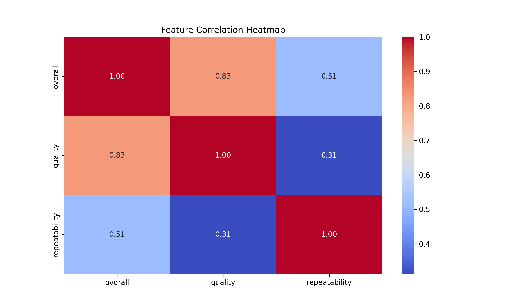

# Automated Data Analysis Report

## Dataset: media.csv

### Summary Statistics

|        | date      | language   | type   | title             | by                |    overall |     quality |   repeatability |
|:-------|:----------|:-----------|:-------|:------------------|:------------------|-----------:|------------:|----------------:|
| count  | 2553      | 2652       | 2652   | 2652              | 2390              | 2652       | 2652        |     2652        |
| unique | 2055      | 11         | 8      | 2312              | 1528              |  nan       |  nan        |      nan        |
| top    | 21-May-06 | English    | movie  | Kanda Naal Mudhal | Kiefer Sutherland |  nan       |  nan        |      nan        |
| freq   | 8         | 1306       | 2211   | 9                 | 48                |  nan       |  nan        |      nan        |
| mean   | nan       | nan        | nan    | nan               | nan               |    3.04751 |    3.20928  |        1.49472  |
| std    | nan       | nan        | nan    | nan               | nan               |    0.76218 |    0.796743 |        0.598289 |
| min    | nan       | nan        | nan    | nan               | nan               |    1       |    1        |        1        |
| 25%    | nan       | nan        | nan    | nan               | nan               |    3       |    3        |        1        |
| 50%    | nan       | nan        | nan    | nan               | nan               |    3       |    3        |        1        |
| 75%    | nan       | nan        | nan    | nan               | nan               |    3       |    4        |        2        |
| max    | nan       | nan        | nan    | nan               | nan               |    5       |    5        |        3        |

### Missing Values

|               |   0 |
|:--------------|----:|
| date          |  99 |
| language      |   0 |
| type          |   0 |
| title         |   0 |
| by            | 262 |
| overall       |   0 |
| quality       |   0 |
| repeatability |   0 |

### Correlation Matrix

|               |   overall |   quality |   repeatability |
|:--------------|----------:|----------:|----------------:|
| overall       |  1        |  0.825935 |        0.5126   |
| quality       |  0.825935 |  1        |        0.312127 |
| repeatability |  0.5126   |  0.312127 |        1        |

### AI-Generated Insights

In analyzing the dataset encompassing a total of 2,652 entries, we can uncover a rich narrative about the content, quality, and user experiences represented within. The dataset covers various titles, predominantly in English, with movie-type content being the most predominant category. 

### Overview of the Dataset
The entries span multiple dates, with 2,055 unique dates recorded from May 21, 2006, featuring notable titles such as "Kanda Naal Mudhal." This film is highlighted as the most frequently noted title in the dataset, appearing nine times, indicating its significance or popularity. The dataset consists solely of movie-type entries, as 2,211 records fall under this classification.

### Language and Contributors
English emerges as the most frequently used language, noted in an impressive 1,306 entries. However, there is a significant gap in authorship, with 262 entries lacking a clearly registered contributor (represented by the column labeled "by"). This raises questions about the recognition of creators and may suggest potential areas for further engagement or standardization in crediting contributors.

### Quality and Ratings
The dataset allows us to examine user-generated feedback through three distinct metrics: "overall," "quality," and "repeatability." The mean ratings are as follows: 
- Overall: 3.05 (on a scale likely from 1 to 5)
- Quality: 3.21
- Repeatability: 1.49

#### Distribution of Ratings
A deeper look into the distribution reveals that overall ratings predominantly hover around the score of 3, while ratings for quality tend to cluster slightly toward the higher end, especially above 3. Notably, repeatability scores indicate a tendency towards lower values, suggesting that while users may enjoy or appreciate the content, they may not always find it compelling enough to experience multiple times.

### Missing Data
It's essential to acknowledge the aspect of missing data, especially concerning dates (99 missing entries) and contributors (262 missing entries). The presence of missing values could indicate potential gaps in the data collection process, leading to an incomplete picture of the dataset�s narrative.

### Correlation Insights
The correlation matrix reveals intriguing associations between the different rating types:
- **Overall vs. Quality (0.826)**: There's a strong positive correlation, indicating that when users rate the overall enjoyment of a title highly, they often do so alongside higher quality assessments. This correlation suggests that perceived quality is a significant contributor to overall satisfaction.
- **Overall vs. Repeatability (0.513)**: The moderate correlation here suggests that while overall ratings influence repeatability, it isn�t as strong, indicating that what users enjoy may not necessarily compel them to revisit the title.
- **Quality vs. Repeatability (0.312)**: This lower correlation implies that the judgment of quality has a minimal influence on the likelihood of viewers rewatching the content.

### Conclusion
In summary, this dataset offers a fascinating glimpse into user interactions with film content. It demonstrates that while viewers generally express satisfaction regarding quality and overall experience, the desire for repeated viewings tends to lag behind. The predominant use of English, the significant presence of the film "Kanda Naal Mudhal," and the absence of contributor data pose interesting areas for further exploration and potentially reveal cultural or stylistic influences determining viewer preferences. Addressing the missing values and enhancing contributor recognition could deepen the dataset's insights, enabling more nuanced understanding and engagement with the content.
### Visualizations

